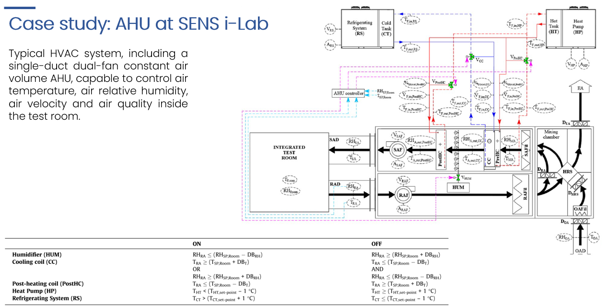

# Analysis of an experimental HVAC system with fully data-driven Bayesian Networks

## Indice
1. [Introduzione](#introduzione)
2. [Descrizione del caso studio](#descrizione-del-caso-studio)
2. [Descrizione del dataset](#descrizione-del-dataset)
3. [Selezione delle variabili di input](#selezione-delle-variabili-di-input)
4. [Modelli data-driven di classificazione](#modelli-data-driven-di-classificazione)
5. [Performance metrics](#performance-metrics)
6. [Conclusioni](#conclusioni)

---

## Introduzione
Questo progetto esplora il funzionamento di tre diversi modelli data-driven di classificazione basati su reti bayesiane applicati ad un sistema HVAC sperimentale.

L'obiettivo principale è quello di testare algoritmi bayesiani più complicati e performanti rispetto al modello Gaussian Naive Bayes, in cui si assume l'indipendenza tra le variabili (sintomi) e la struttura della rete risulta quindi abbastanza banale.
Il modello Gaussian Naive Bayes può essere sviluppato e valutato in modo semplice e veloce utilizzando la libreria scikit-learn.

---

## Descrizione del caso studio
Il sistema HVAC analizzato è composto da un'UTA a volume d'aria costante a doppio ventilatore e singolo condotto.
Esso è progettato per controllare la temperatura dell'aria, l'umidità relativa, la velocità dell'aria e la qualità dell'aria all'interno di una stanza di test.

Il layout dell'impianto, le variabili monitorate e le logiche di controllo del sistema sono riportate nella seguente immagine:

- Maggiori dettagli: [Informazioni specifiche AHU del SENS i-Lab](https://www.sciencedirect.com/science/article/pii/S0378778822006636)

---

## Descrizione del dataset
Il dataset, in formato .csv, è già stato preprocessato e contiene dati etichettati per condizioni normali e per diverse tipologie di guasti.
Le misurazioni sono state acquisite durante la stagione estiva con un timestep di 1 minuto. Inoltre, le potenze termiche delle due batterie sono state calcolate utilizzando la portata e la differenza di temperatura (virtual sensor), mentre gli stati on/off dei componenti sono stati derivati in base alle logiche di controllo precedentemente definite.

---

## Selezione delle variabili di input
La selezione delle variabili di input è un passaggio fondamentale e il numero di queste può essere impostato dall'utente.
Fissata la quantità, il criterio utilizzato per scegliere le variabili più rilevanti si basa sul ranking dell'indice di mutua informazione (MI score).
In particolare:

- Nel caso di modelli continui, viene utilizzato un numero di bin estremamente elevato, mantenendo così il valore numerico originale.
- Nel caso di modelli discreti, viene applicata una discretizzazione in base a un numero di bin scelto dall'utente (solitamente tra 3 e 7).

---

## Modelli data-driven di classificazione
Sono stati implementati tre diversi modelli di classificazione basati su reti bayesiane:

### 1) Conditional Gaussian Network (CGN)
Si tratta di una rete bayesiana che modella le relazioni probabilistiche tra sintomi (variabili continue) utilizzando distribuzioni gaussiane condizionate per ogni etichetta.
Grazie alla definizione del parametro **alpha**, il modello è in grado di ridurre il False Alarm Rate (FAR).

- Maggiori dettagli: [CGN classifier with probabilistic boundary](https://www.sciencedirect.com/science/article/pii/S1359431116310675)

### 2) Kernel Density Estimation (KDE)
Questo modello utilizza una stima della densità a kernel per approssimare le distribuzioni di probabilità delle variabili continue e delineare le interconnessioni probabilistiche tra di esse per ciascuna etichetta, senza fare ipotesi parametriche.
La struttura della rete è la stessa del modello CGN e grazie alla definizione del parametro **Lp**, il modello è in grado di ridurre il False Alarm Rate (FAR).

- Maggiori dettagli: [FDD using Interpolated Kernel Density Estimate](https://www.sciencedirect.com/science/article/pii/S0263224121002438)

### 3) Cost-Sensitive Tree Augmented Naive Bayesian Network (TAN)
Un'estensione del modello Naive Bayes che introduce una struttura ad albero in grado di catturare le dipendenze tra i sintomi (variabili selezionate), migliorando la capacità di classificazione.
Inoltre, grazie alla possibilità di definire una **cost list** (cioè un peso per ogni classe), il modello è in grado di gestire meglio situazioni di sbilanciamento e dare priorità a determinate etichette.

- Maggiori dettagli: [Discrete Bayesian Networks](https://www.sciencedirect.com/science/article/pii/S0140700719301070); [Cost-sensitive Bayesian network classifiers](https://www.sciencedirect.com/science/article/pii/S0167865514001354)

---

## Performance metrics
Le prestazioni dei modelli sono state valutate utilizzando le seguenti metriche:
- Accuracy
- False Alarm Rate
- False Negative Rate
- Mis-Diagnosis Rate
- Precision (per ogni classe)
- Recall (per ogni classe)

---

## Conclusioni
Questo progetto offre un'analisi delle prestazioni di diversi modelli di classificazione bayesiani (fully data-driven) applicati ad un sistema HVAC.

Per ulteriori dettagli, non esitare a contattare il creatore [Marco Paolini](https://github.com/Paolini408).
